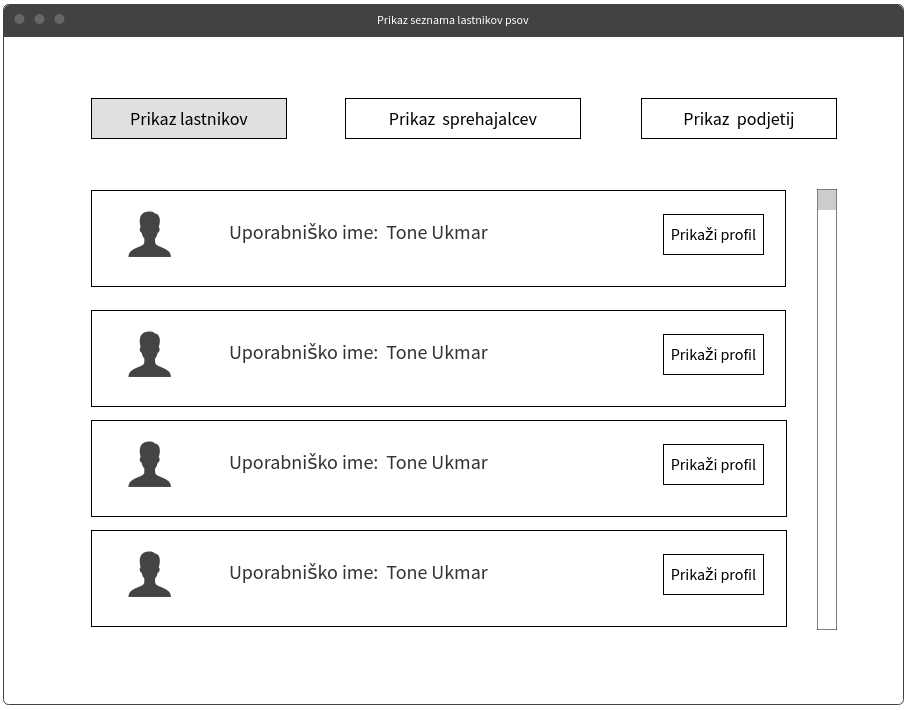

# Dokument zahtev

|                             |                                                                         |
| :-------------------------- | :---------------------------------------------------------------------- |
| **Naziv projekta**          | Dog Walkers                                                             |
| **Člani projektne skupine** | Koren Aljoša, Škrlj Klemen, Uran Maj, Štrosar Grmek Loris, Tavčar Simon |
| **Kraj in datum**           | Slovenija, 22.03.2021                                                   |

## Povzetek projekta

Dokument se ukvarja z zajemom zahtev problemske tematike sprehajanja psov. V dokumentu je naštetih 5 uporabniških vlog, ki se pojavijo v naši aplikaciji: neregistriran uporabnik, administrator, registriran uporabnik, lastnik psa, sprehajalec in podjetje. Za tem je prikazan diagram primerov uporabe. Aplikacija je sestavljena iz 26 funkcionalnih zahtev od katerih so 13 tipa MUST have, 7 tipa SHOULD have, 4 tipa COULD have in 2 tipa WOULD have. Projekt ima tudi nekaj nefunkcionalnih zahtev in sicer 6 zahtev izdelka, 4 organizacijske in 3 zunanje zahteve. Poleg tega pa ima aplikacija še 3 zunanje akterje do katerih dostopamo preko vmesnikov. Eden od teh je OpenStreetMap za podatke o lokacijah krajev, drugi je služba za odnose s strankami, ki sprejema vse prijave neprimerne vsebine naših uporabnikov in se odzove na njih. Tretji primer pa je zunanji sistem, ki lahko preko našega REST API-ja pridobi enostavno statistiko iz naših podatkovnih baz. V dokumentu so še vse zaslonske maske in podroben opis vmesnikov do zunanjih akterjev.

## 1. Uvod

### 1.1 Problemska domena

Naša rešitev je namenjena vsem ljubiteljem psov, tako lastnikom štirinožnih prijateljev kot tudi ljudem, ki si trenutno psa ne morejo privoščiti zaradi omejenega časa, prevelikega finančnega zalogaja ali morda zato ker doma nimajo dovolj prostora. Namen našega projekta je v tem, da bi preko svetovnega spleta povezali neznance z obeh strani in tako omogočili ljudem brez hišnih ljubljenčkov stik z le temi, lastnike pa bi razbremenili bremena, ki ga nosijo s seboj.

Spletni vmesnik bo lastniku psa omogočal enostavno iskanje potencialnih sprehajalcev. Inspiracijo za tako idejo smo dobili iz vse bolj popularnih aplikacij za iskanje zmenkov (npr. Tinder), kjer je cilj preko enostavnega vmesnika čim bolj hitro izbrati prave oglase zase in se z izbranimi še bolj podrobno pogovoriti. Uporabniki bodo preko naše platforme uporabljali enostavni klepetalnik ter spoznali potencialne "pare", se dogovorili za kraj ter čas zmenka in tako sklenili nekakšno pogodbo. Aplikacija bo omogočala prijavo neprimernih oglasov ter s tem pridobila zaupanje lastnikov, saj bi se marsikdo morda počutil zadržanega dati svojega psa neznancu. Sprehajalci bi lahko ocenili psa in lastnika glede obnašanja, držanja dogovora in na splošno odnosa, lastniki psov pa bi prav tako lahko ocenili sprehajalce. Poleg tega bi dodali tudi podjetja, ki se ukvarjajo z nego psov ter veterinarje, ki bi lahko oglaševali svoje storitve in se prav tako povezali z lastniki psov.

### 1.2 Funkcionalne zahteve

Pred začetkom uporabe aplikacije se mora oseba registrirati z uporabniškim imenom, geslom in svojim email-om. Izbrati mora tudi svojo vlogo: lastnik, sprehajalec ali podjetje.

Neglede na izbiro vloge je registriranemu uporabniku omogočeno urejanje svojega profila. To je ključna funkcionalnost za naše uporabnike, saj se lahko s kratkim opisom in prikazno fotografijo enostavno in hitro predstavijo drugim uporabnikom. Za lastnika psa je pri izbiri potencialnega sprehajalca zelo pomembno vprašanje, ali lahko tej osebi zaupa. S klikom na profil sogovorca se prepriča, če se je sploh vredno dogovarjati za srečanje. Enako velja v drugo smer, sprehajalca tudi skrbi čigavega psa bo sprehajal. Urejanje profila je seveda pomembno tudi za podjetja, ki se želijo predstavit kot zaupanja vredna, da morda privabijo nove potencialne stranke.

Seveda imajo lastnik, sprehajalec in podjetje možnost povsem izbrisat svoj profil, če niso zadovoljni z aplikacijo.

Uporabniški vlogi sprehajalec in podjetje imata možnost ustvarjanja novih oglasov. Oglas sestavita iz ključnih informacij o storitvi, ki jih lahko nato lastnik psa vidi na seznamu oglasov. Sprehajalec in podjetje lahko opremita svoj oglas s sliko, lokacijo in kratkim opisom storitve. Sprehajalec mora v svoj oglas dodati začeten in končen čas storitve, da lahko lastniki psov poiščejo oglas sprehajalca za določeno uro in dan, ko ga potrebujejo. Podjetja pa morajo v svoj oglas navesti svoje kontaktne podatke. Sprehajalcu kontaktnih podatkov ni treba dodati v oglas, saj se pogovor med lastnikom in sprehajalcem odvija kar v klepetalniku, ki je del naše storitve.

Sprehajalci in podjetja imajo možnost pregleda vseh svojih aktivnih oglasov ter brisanje in urejanje le-teh.

Ključna funkcionalnost za lastnika psa je pregled seznama vseh oglasov v obliki kartic, ki prikazujejo po en oglas na enkrat. Na vsaki kartici je oglas, ki ga je predhodno sprehajalec ali podjetje sestavilo. Ob oglasu se lastniku psa pojavijo 4 gumbi: »Zavrni«, »Sprejmi«, »Profil« in »Prijava uporabnika«. S klikom na gumb »Zavrni«, lahko lastnik zavrne oglas, ta se umakne in prikaže se mu nov oglas. Lastnik lahko sprejme oglas s klikom na gumb »Sprejmi«. Če je oglas objavilo podjetje, ga aplikacija preusmeri na spletno stran podjetja. Če pa je oglas objavil sprehajalec, se ta doda na seznam lastnikovih pogovorov. S klikom na gumb »Prijava uporabnika« lahko lastnik psa prijavi drugega registriranega uporabnika zaradi kakršnekoli neprimerne vsebine, ki jo vidi na aplikaciji. Prijava je poslana neposredno službi za odnose s strankami, ki preveri in določi, kakšna sankcija je primerna in svojo ugotovitev pošlje administratorju. S klikom na gumb »Profil«, si lahko lastnik ogleda profil sprehajalca z vsemi njegovimi aktivnimi oglasi. Na tujem profilu ima lastnik možnost podati oceno v obliki zvezdic od 1 do 5.

Lastniki psov lahko seznam oglasov filtrirajo po oceni ali po oddaljenosti ter tako še hitreje pride do želene storitve. Pri filtriranju po oddaljenosti se za razdljo med lokacijami uporablja zunanji akter OpenStreetMap.

Lastniki psov in spehajalci imajo možnost prikaza seznama pogovorov. Tu so v seznamu našteta imena vseh oseb s katerimi so stopili v kontakt preko naše aplikacije. S klikom na ime, se uporabniku prikaže pogovor s to osebo. Tu se lahko uporabniki med seboj dogovarjajo v obliki sporočil. Preko klepetalnika lahko kliknejo na gumb za ogled profila sogovornika, lahko podajo oceno sogovorniku ali pa ga prijavijo. Sogovorca lahko v pogovoru s klikom na gumb generirata varnostno šifro, ki je 6 mestna koda s katero se lahko identificirata v resničnem življenju. Tako lahko zagotovimo še eno dodatno plast varovanja hišnega ljubljenčka, saj si ne želimo, da bi ta šel v roke sprehajalca z lažno identiteto.

Administrator ima dostop do seznama vseh profilov lastnikov psov, vseh profilov sprehajalcev in vseh profilov podjetji. Ti so mu prikazani v obliki seznamov. Vsak profil lahko klikne in si ga ogleda. Administratorjev pregled profila se razlikuje od pregleda profila drugih uporabnikov, saj lahko poljubno briše oglase vseh uporabnikov. Če zazna neprimeren profil, pa ga lahko v celoti izbriše.

Spletna storitev izdeluje tudi statistiko o uporabnikih. Ta je zunanjim sistemom dosegljiva preko našega REST API-ja. Tako lahko drugi sistemi pridobijo informacijo o številu vseh naših uporabnikov, številu uporabnikov glede na vlogo, številu aktivnih oglasov in številu oglasov glede na uporabniško vlogo, ki jih je naredila (sprehajalec ali podjetje).

### 1.3 Nefunkcionalne zahteve

Celotna spletna aplikacija bo razvita razvita po principih slapovnega razvoja s pomočjo tehnologij MongoDB, Express.js, Handlebars.js, Node.js. Končni izdelek bo gostovan v oblaku oblačne storitve Heroku. Uporabljala se bo tudi PostgreSQL baza za shranjevanje računov uporabnikov, saj so ti podatki bolj občutljivi in je sql baza zaradi varnosti bolj primerna za njih.

Bistvene zahteve za končnega uporabnika se tičejo zmogljivosti aplikacije. Zanj je pomembno, da je aplikacija javno dostopna veliko večino časa in se naloži relativno hitro. Zato bomo pri razvoju poskrbeli za to, da se spletna aplikacija naloži v največ 3 sekundah, je zmožna streči 1000 hkratnim uporabnikom in da je dostopna 99% vsega časa. Tokom razvoja bomo preverjali delovanje aplikacije na vseh glavnih brskalnikih (Firefox, Chrome, Safari, Edge) in poskrbeli, da je povsod enako. Uporaba našega sistema bo morala biti dostopna čim več ljudem in ne sme izključevati ljudi z okvarami vida, okvarami sluha, motnjami gibljivosti, kognitivnimi motnjami..

Za pridobitev zaupanja uporabnikov, bo moral biti sistem razvit tako, da ne sme uporabniku omogočiti dostopa do podatkov, za katere ni izrecno pooblaščen. Zbirali bomo le nujno potrebne podatke o uporabnikih in ravnali v skaldu z zakonodajo GDPR.

Uporabnikom bomo dali jasno vedeti, da je raba sistema na lastno odgovornost. Pred registracijo bodo morali sprejeti splošne pogoje poslovanja.

## 2. Uporabniške vloge

- Neregistriran uporabnik - uporabnik, ki še ni izvedel registracije
- Administrator - uporabnik, ki ima skrbniške pravice
- Registriran uporabnik - uporabnik, ki je že izvedel registracijo
- Lastnik psa - tip registriranega uporabnika, ki je pri registraciji izbral vlogo Lastnik psa
- Sprehajalec - tip registriranega uporabnika, ki je pri registraciji izbral vlogo sprehajalca
- Podjetje - tip registriranega uporabnika, ki je pri registraciji izbral vlogo podjetja

## 3. Slovar pojmov

- REST - Representational state transfer je arhitekturni stil za izdelavo interakcij aplikacij, ki uporabljajo spletne storitve
- API - application programming interface, omogoča komunikacijo med dvema aplikacijama
- JSON Object - je objekt, ki vsebuje ključ/vrednost pare
- JSON Array - je seznam, ki vsebuje JSON objekte
- HTTP - Hypertext Transfer Protocol, je glavna metoda za prenos informacij na spletu
- GET request - je HTTP operacija, ki zahteva podatke iz določenega vira
- GDPR - General Data Protection Regulations oz. Splošna uredba EU o varstvu podatkov
- MongoDB: je dokumentno orientirana NoSQL podatkovna baza, ki uporablja dokumente v JSON obliki
- Express je Node.js ogrodje za razvoj spletnih aplikacij
- Handlebars.js je orodje za gradnjo čelnega dela spletnih aplikacij
- Node.js je orodje za izgradnjo zalednega dela spletnih aplikacij
- Waterfall metoda razvoja - Model vodnega slapa, zaporedno izvajanje faz razvoja
- MUST have - prioriteta funkcionalnosti. Gre za eno od glavnih funkcionalnosti sistema. Če jo izpustimo, bo sistem preveč okrnjen, da bi ga lahko smiselno uporabljali.
- SHOULD have - prioriteta funkcionalnosti. Funkcionalnost je pomembna, a ne neobhodno potrebna. Če jo izpustimo, bomo sistem še vedno lahko uporabljali, čeprav bo uporabniška izkušnja vsaj delno okrnjena.
- COULD have - prioriteta funkcionalnosti. Funkcionalnost je sicer zaželena, vendar pa ne bo pretirane škode, če jo izpustimo.
- WOULD have (Won't have this time) - prioriteta funkcionalnosti. Zanimiva ideja, a je v tem trenutku ne bomo realizirali. Morda v naslednji izdaji.

## 4. Diagram primerov uporabe

## 5. Funkcionalne zahteve

### Registracija

#### Povzetek funkcionalnosti

Neregistriran uporabnik se lahko prijavi v naš sistem tako, da v obrazec na spletni strani vpiše uporabniško ime, email, geslo, izbere vlogo iz spustnega menija, označi polje, kjer sprejme pravila poslovanja ter nato klikne gumb na registracijo.

#### Osnovni tok

1. Neregistriran uporabnik na naši spletni strani klikne na gumb za registracijo.
2. Aplikacija mu pokaže obrazec z emailom, geslom, uporabniškim imenom in uporabniško vlogo
3. Neregistriran uporabnik izpolne vsa vnosna polja in obkljuka polje, da se strinja s pogoji poslovanja
4. Neregistriran uporabnik klikne na gumb "Potrdi".
5. Sistem registrira uporabnika ter ga preusmeri na prvo stran glede na uporabniško vlogo.

#### Alternativni tok(ovi)

Funkcionalnost nima alternativnih tokov.

#### Izjemni tok(ovi)

Izjemni tok 1 - email zaseden:

- Email, ki ga neregistriran uporabnik vpiše v za to namenjeno polje, je že v naši bazi. Ob kliku "Potrdi" se registracija ne izvede, neregistriranemu uporabniku pa se izpiše obvestilo. V obvestilu se izpiše razlog za napako in prosi za popravek.

Izjemni tok 2 - geslo preslabo:

- Geslo, ki ga neregistriran uporabnik vpiše v za to namenjeno polje, ne ustreza varnostnim standardom naše aplikacije. Ob kliku "Potrdi" se registracija ne izvede, neregistriranem uporabniku pa se izpiše obvestilo. V obvestilu se izpiše razlog za napako in prosi za popravek.

#### Pogoji

Pogoji, da se funkcionalnost lahko začne izvajati je, da neregistriran uporabnik izpolni vsa polja, vpiše email, ki še ne obstaja v naši bazi in geslo, ki vsebuje 8 znakov, vsaj eno veliko črko, eno malo, en poseben znak in eno število.

#### Posledice

Rezultat osnovnega toka te funkcionalnosti je v sistemu na novo registriran uporabnik.

#### Posebnosti

Funkcionalnost nima posebnosti.

#### Prioritete identificiranih funkcionalnosti

Funkcionalnost spada v MUST have.

#### Sprejemni testi

Testira se osnovni tok:

1. Neregistriran uporabnik je na naši spletni strani.
2. Neregistriran uporabnik klikne gumb za registracijo.
3. Neregistriran uporabnik vpiše podatke v polja - email "j99@gmail.com", geslo "M0cn0G3s!0", uporabniško ime "Janez", izbere vlogo "sprehajalec" in označi pogoje poslovanja
4. Neregistriran uporabnik klikne gumb za registracijo.
5. Sistem registrira uporabnika ter ga preusmeri na prvo stran uporabniške vloge sprehajalec.

Testira se izjemni tok 1:

1. Neregistriran uporabnik je na naši spletni strani.
2. Neregistriran uporabnik klikne gumb za registracijo.
3. V bazo ročno dodamo uporabnika, ki ima za email "j99@gmail.com"
4. Neregistriran uporabnik vpiše podatke v polja - email "j99@gmail.com", geslo "M0cn0G3s!0", uporabniško ime "Janez", izbere vlogo "sprehajalec" in označi pogoje poslovanja
5. Neregistriran uporabnik klikne gumb za registracijo.
6. Sistem neregistriranega uporabnika ne registrira, vrne ga na prejšnjo stran in izpiše pravilno obvestilo
7. Izpiše se obvestilo, ki pove da je bil email že uporabljen

Testira se izjemni tok 2:

1. Neregistriran uporabnik je na naši spletni strani.
2. Neregistriran uporabnik klikne gumb za registracijo.
3. Neregistriran uporabnik vpiše podatke v polja - email "j99@gmail.com", geslo "slabogeslo", uporabniško ime "Janez", izbere vlogo "sprehajalec" in označi pogoje poslovanja
4. Neregistriran uporabnik klikne gumb za registracijo.
5. Sistem neregistriranega uporabnika ne registrira, vrne ga na prejšnjo stran
6. Izpiše se obvestilo, ki pove da je bilo geslo preslabo

### Prijava

#### Povzetek funkcionalnosti

Registriran uporabnik ali administrator se lahko prijavi v našo aplikacijo z računom, ki ga je pred tem že ustvaril.

#### Osnovni tok

Osnovni tok 1:

1. Registriran uporabnik na prvi strani aplikacije klikne na gumb "Prijava"
2. V polje za e-mail vpiše e-mail s katerim se je prijavil, v polje za geslo pa njegovo geslo
3. Registriran uporabnik klikne gumb "Potrdi"
4. Sistem uporabnika preusmeri na pravilno prvo stran, glede na njegovo uporabniško vlogo

Osnovni tok 2:

1. Administrator na prvi strani aplikacije klikne na gumb "Prijava"
2. V polje za e-mail vpiše administratorski e-mail, v polje za geslo pa pravilno geslo tega računa
3. Administrator klikne na gumb "Potrdi
4. Sistem uporabnika preusmeri na prvo stran namenjeno administratorju

#### Alternativni tok(ovi)

Funkcionalnost nima alternativnega toka.

#### Izjemni tok(ovi)

Izjemni tok 1 - napačen e-mail:

- Registriran uporabnik/Administrator vpiše e-mail, ki ni povezan z nobenim računom v naši bazi. Sistem uporabnika obvesti o napaki in prijave ne izvede.

Izjemni tok 2 - napačno geslo:

- Registriran uporabnik/Administrator vpiše geslo, ki se ne ujema z uporabniškim računom, ki je shranjen v naši bazi pod vpisanim emailom. Sistem uporabnika obvesti o napaki in prijave ne izvede.

#### Pogoji

Uporabnik mora imeti v našem sistemu že narejen uporabniški račun

#### Posledice

Uporabnik je prijavljen v sistem in lahko dostopa do za njega namenjenih funkcionalnosti

#### Posebnosti

Funkcionalnost nima posebnosti.

#### Prioritete identificiranih funkcionalnosti

Funkcionalnost ima prioriteto MUST have.

#### Sprejemni testi

Testira se osnovni tok 1:

1. Registriran uporabnik na prvi strani klikne na gumb "Prijava"
2. V podatkovni bazi obstaja uporabniški račun, ki ima za email "j99@gmail.com" in za geslo "M0cn0G3s!0"
3. Registriran uporabnik vpiše v polje za email "j99@gmail.com" in za geslo "M0cn0G3s!0" ter klikne "Potrdi"
4. Sistem prijavi registriranega uporabnika in ga preusmeri na prvo stran glede na njegovo uporabniško vlogo

Testira se osnovni tok 2:

1. Administrator na prvi strani klikne gumb "Prijava"
2. V podatkovni bazi obstaja uporabniški račun, ki ima za email "admin@gmail.com" in za geslo "M0cn0G3s!0Admin"
3. Administrator vpiše v polje za email "admin@gmail.com" in za geslo "M0cn0G3s!0Admin" ter klikne "Potrdi"
4. Sistem prijavi administratorja in ga preusmeri na prvo stran administrativnega pogleda

Testira se izjemni tok 1:

1. Registriran uporabnik/Administrator na prvi strani klikne na gumb "Prijava"
2. Registriran uporabnik/Administrator vpiše v polje za email "janez@gmail.com" in za geslo "M0cn0G3s!0"
3. V podatkovni bazi ne obstaja nobenga Registriran uporabnik/Administrator z emailom "janez@gmail.com"
4. Sistem prijave ne naredi, Registriran uporabnik/Administrator obvesti o napaki

Testira se izjemni tok 2:

1. Registriran uporabnik/Administrator na prvi strani klikne na gumb "Prijava"
2. V podatkovni bazi naredimo testnega uporabnika z emailom "j99@gmail.com" in z geslom "M0cn0G3s!0"
3. Registriran uporabnik/Administrator vpiše v polje za email "j99@gmail.com" in za geslo "NapacnoG3s!o"
4. Napisano geslo in geslo v naši bazi se ne ujemata zato sistem prijave ne naredi, Registriran uporabnik/Administrator obvesti o napaki

### Prikaz seznama lastnikov psov

#### Povzetek funkcionalnosti

Administrator lahko vidi seznam vseh lastnikov psov, ki imajo narejen profil v aplikaciji. Pri tem lahko pri vsakem registriranem uporabniku vidi njegovo profilno sliko in njegovo uporabnišku ime, poleg tega pa se ob vsakem lastniku psa pokaže gumb za prikaz profila registriranega uporabnika -> funkcionalnost "Administratorjev pregled profila".

#### Osnovni tok

1. Administrator se nahaja na njegovi domači strani
2. Administrator v zgornji kontrolni vrstici klikne gumb "Prikaz lastnikov"
3. Prikažejo se mu vsi registrirani uporabniki, ki so pri registraciji izbrali vlogo lastnika psa
4. Vsak lastnik psa ima na levi prikazano njegovo profilno sliko, poleg nje se izpiše njegovo uporabniško ime, na desni pa je gumb za prikaz njegovega profila
5. Administrator lahko z miško ob strani manevrira gor in dol po seznamu

#### Alternativni tok(ovi)

Funkcionalnost nima alternativnega tokova.

#### Pogoji

Uporabnik mora biti prijavljen kot administrator.

#### Posledice

Administator dobi celoten seznam registriranih uporabnik, ki so prijavljeni kot lastniki psov.

#### Posebnosti

Funkcionalnost nima nobenih posebnosti.

#### Prioritete identificiranih funkcionalnosti

Funkcionalnost ima prioriteto SHOULD have.

#### Sprejemni testi

Testira se osnovni tok

- Registriran uporabnik se prijavi z uporabniškim računom administratorja
- Administrator klikne na gumb "Prikaz lastnikov"
- Prikaže se mu seznam vseh registriranih uporabnikov, ki imajo vlogo lastnika psov
- Vsak uporabnik na seznamu ima na levi strani prikazano profilno sliko, poleg nje njegovo uporabniško ime in na desni gumb za prikaz profila

### Prikaz seznama sprehajalcev

#### Povzetek funkcionalnosti

Administrator lahko vidi seznam vseh sprehajalcev. Pri tem lahko pri vsakem vidi uporabniško ime sprehajalca in na desni gumb za prikaz profila -> funkcionalnost "Administratorjev pregled profila".

#### Osnovni tok

1. Administrator se nahaja na njegovi domači strani
2. Administrator v zgornji kontrolni vrstici klikne gumb "Prikaz sprehajalcev"
3. Prikažejo se mu vsi registrirani uporabniki, ki so pri registraciji izbrali vlogo sprehajalec
4. Vsak sprehajalec ima prikazano uporabniško ime in na desni gumb za prikaz profila
5. Administrator lahko z miško ob strani manevrira gor in dol po seznami

#### Alternativni tok(ovi)

Funkcionalnost nima alternativnega tokova.

#### Pogoji

Uporabnik mora biti prijavljen kot administrator.

#### Posledice

Administator dobi celoten seznam sprehajalcev.

#### Posebnosti

Funkcionalnost nima nobenih posebnosti.

#### Prioritete identificiranih funkcionalnosti

Funkcionalnost ima prioriteto SHOULD have.

#### Sprejemni testi

Testira se osnovni tok:

1. Administrator se prijavi z uporabniškim računom administratorja
2. Administrator klikne na gumb "Prikaz sprehajalcev"
3. Prikaže se mu seznam vseh sprehajalcev
4. Vsak sprehajalec ima ime uporabnika in na desni gumb za prikaz profila

### Prikaz seznama podjetij

#### Povzetek funkcionalnosti

Administrator lahko vidi seznam vseh podjetij. Pri tem lahko pri vsakem vidi uporabniško ime podjetja in na desni gumb za prikaz profila -> funkcionalnost "Administratorjev pregled profila".

#### Osnovni tok

1. Administrator se nahaja na njegovi domači strani
2. Administrator v zgornji kontrolni vrstici klikne gumb "Prikaz podjetij"
3. Prikažejo se mu vsi registrirani uporabniki, ki so pri registraciji izbrali vlogo podjetja
4. Vsako podjetje ima prikazano uporabniško ime in na desni gumb za prikaz profila
5. Administrator lahko z miško ob strani manevrira gor in dol po seznamu

#### Alternativni tok(ovi)

Funkcionalnost nima alternativnega tokova.

#### Pogoji

Uporabnik mora biti prijavljen kot administrator.

#### Posledice

Administrator dobi celoten seznam podjetij.

#### Posebnosti

Funkcionalnost nima nobenih posebnosti.

#### Prioritete identificiranih funkcionalnosti

Funkcionalnost ima prioriteto SHOULD have.

#### Sprejemni testi

Testira se osnovni tok:

1. Administrator se prijavi z uporabniškim računom administratorja
2. Administrator klikne na gumb "Prikaz podjetij"
3. Prikaže se mu seznam vseh podjetij
4. Vsako podjetje ima ime podjetja in na desni gumb za prikaz profila

### Administratorjev pregled profila

#### Povzetek funkcionalnosti

Administrator s klikom na gumb "Prikaži profil" dobi vpogled v pregled profila kateregakoli registriranega uporabnika. Če ima ta registriran uporabnik vlogo lastnika psa, se mu prikaže stran z vsemi podatki lastnika psa, če pa je profil registriranega uporabnika tipa sprehajalec ali podjetje, pa ima administrator vpogled v vse njihove aktivne oglase. Funkcionalnost ima razširitveni točki za funkcionalnosti "Brisanje oglasa" in "Brisanje profila"

#### Osnovni tok

Osnovni tok 1:

1. Administrator se nahaja na seznamu lastnikov psov
2. Administrator klikne na gumb "Prikaži profil" na enemu izmed lestnikov psa
3. Prikaže se mu profil lastnika psa, kjer je vidna njegova slika, uporabniško ime, lokacija, opis in ocena

Osnovni tok 2:

1. Administrator se nahaja na seznamu sprehajalcev
2. Administrator klikne na gumb "Prikaži profil" na enemu izmed sprehajalcev
3. Prikaže se mu profil sprehajalca, ki vsebuje seznam vseh njegovih aktivnih oglasov z vsemi njihovimi informacijami

Osnovni tok 3:

1. Administrator se nahaja na seznamu podjetij
2. Administrator klikne na gumb "Prikaži profil" na enemu izmed podjetij
3. Prikaže se mu profil podjetja, ki vsebuje seznam vseh njegovih aktivnih oglasov z vsemi njihovimi informacijami

#### Alternativni tok(ovi)

Funkcionalnosti nima alternativnega toka.

#### Izjemni tok(ovi)

Izjemni tok - Profil je bil izbrisan
- Administrator želi dostopati do podrobnosti profila registriranega uporabnika, ki je v tem času izbrisal svoj profil. Administratorju se izpiše obvestilo, seznam se posodobi.

#### Pogoji

Uporabnik mora biti prijavljen kot administrator in klikniti na enega izmed registriranih uporabnikov na seznamu.

#### Posledice

Adnimistrator ima pogled v uporabnikov profil.

#### Posebnosti

Funkcionalnost nima nobenih posebnosti.

#### Prioritete identificiranih funkcionalnosti

Funkcionalnost ima prioriteto SHOULD have.

#### Sprejemni testi

Testira se osnovni tok 1:

1. Administrator se nahaja na seznamu lastnikov psov
2. Administrator klikne na gumb "Prikaži profil" na lastniku psa z imenom TestTest iz seznama
3. Prikaže se mu profil lastnika psa TestTest z njegovo profilno sliko, uporabniškim imenom, lokacijo, opisom in oceno

Testira se osnovni tok 2:

1. Administrator se nahaja na seznamu sprehajalcev
2. Administrator klikne na gumb "Prikaži profil" na sprehajalcu TestTestSprehajalec iz seznama
3. Prikaže se mu seznam vseh njegovih aktivnih oglasov
4. Vsak oglas ima sliko, uporabniško ime uporabnika, njegovo oceno, lokacijo, čas izvajanja, opis sprehoda in opis sprehajalca

Testira se osnovni tok 3:

1. Administrator se nahaja na seznamu podjetja
2. Administrator klikne na gumb "Prikaži profil" na podjetju TestTestPodjetje iz seznama
3. Prikaže se mu seznam vseh njegovih aktivnih oglasov
4. Vsak oglas ima sliko, uporabniško ime uporabnika, lokacijo, kontaktne podatke, opis storitve in opis podjetja

Testira se izjemni tok:

1. Administrator se nahaja na seznamu podjetja
2. Ročno odstranimo podjetje TestTestPodjetje iz naše baze
3. Administrator klikne gumb "Prikaži profil" na podjetju TestTestPodjetje
4. Izpiše se mu obvestilo o napaki, seznam se posodobi

### Brisanje oglasa

#### Povzetek funkcionalnosti

Administrator lahko izbriše katerikoli aktivni oglas, ki ga je naredil sprehajalec ali podjetje.

#### Osnovni tok

1. Administrator se nahaja na administratorjevem pogledu profila sprehajalca ali podjetja
2. Administrator izbere oglas iz seznama aktivnih oglasov izbranega oglasa
3. Administrator klikne na gumb "x", ki se nahaja ob oglasu
4. Sistem oglas odstrani iz profila izbranega sprehajalca ali podjetja, seznam aktivnih oglasov se posodobi

#### Alternativni tok(ovi)

Funkcionalnost nima alternativnega toka

#### Izjemni tok(ovi)
Izjemni tok - Oglas je bil izbrisan
- Administrator klikne na gumb "x" ob oglasu, ki ga je izbrani sprehajalec ali podjetje v tem času že izbrisal. Sistem administratorja obvesti o napaki, seznam aktivnih oglasov tega sprehajalca ali podjetja se posodobi

#### Pogoji

Uporabnik mora biti prijavljen kot administrator

#### Posledice

Oglas se odstrani iz seznama aktivnih oglasov izbranega sprehajalca ali podjetja

#### Posebnosti

Funkcionalnosti nima nobenih posebnosti

#### Prioritete identificiranih funkcionalnosti

Funkcionalnost ima prioriteto COULD have

#### Sprejemni testi

Testira se osnovni tok:

1. Administrator se nahaja na administratorskem pregledu profila TestTestSprehajalec, ki je sprehajalec
2. Administrator klikne na gumb "x" ob prvem oglasu sprehajalca
3. Sistem oglas odstrani iz seznama aktivnih oglasov sprehajalca, administratorjev seznam se posodobi

Testiranje izjemnega toka:

1. Administrator se nahaja na administratorskem pregledu profila testnega uporabnika TestTestSprehajalec, ki je sprehajalec
2. Iz podatkovne baze ročno odstranimo aktivni oglas testnega uporabnika
3. Administrator klikne na gumb "x" ob oglasu, ki smo ga ravnokar ročno odstranili
4. Sistem administratorja obvesti o napaki in posodobi administratorjev seznam oglasov

### Urejanje profila

#### Povzetek funkcionalnosti

Registrirani uporabnik lahko ureja svoje podatke na profilu, ki so vidni drugim registriranim uporabnikom. Funkcionalnost ima razširitveno točko za funkcionalnost "Brisanje profila".

#### Osnovni tok

Osnovni tok 1:

1. Lastnika psa se nahaja na njegovi prvi strani, kjer pregleduje oglase drugih
2. Lastnik psa klikne na gumb "Moj profil"
3. Lastnik psa spremeni vsaj enega od podanih parametrov svojega profila: profilna slika, uporabniško ime, geslo, lokacijo in njegov opis
4. Ob koncu urejanja lastnik psa klikne "Shrani spremembe"
5. Sistem posodobi podatke njegovega računa, lastnika psa obvesti o uspešni spremembi

Osnovni tok 2:

1. Sprehajalca ali podjetja se nahaja na njegovi prvi strani, kjer pregleduje svoje oglase
2. Sprehajalec ali podjetje klikne na gumb "Moj profil"
3. Sprehajalec ali podjetje spremeni vsaj enega od podanih parametrov svojega profila: uporabniško ime, geslo in opis ter spletno stran, če je to podjetje
4. Ob koncu urejanja sprehajalec ali podjetje klikne na gumb "Shrani spremembe"
5. Sistem posodobi podatke njegovega računa, sprehajalca ali podjetje obvesti o uspešni spremembi

#### Alternativni tok(ovi)

Funkcionalnosti nima alternativnega toka

#### Izjemni tok(ovi)

Izjemni tok 1 - napacna lokacija:

- Registriran uporabnik s sprecializirano vlogo lastnika psa vpiše v polje za lokacijo kraj, ki ne obstaja. Ob pritisku na gumb "Shrani spremembe" sistem podatkov ne shrani, lastnika psa obvesti o napaki

Izjemni tok 2 - geslo preslabo:

- Registriran uporabnik želi pososdobiti geslo na geslo, ki ni dovolj močno. Ob kliku na gumb "Shrani spremembe" sistem podatkov ne shrani, registriranega uporabnika obvesti o napaki.

#### Pogoji

Uporabnik mora biti registriran uporabnik.

#### Posledice

Podatki profila registriranega uporabnika se posodobijo.

#### Posebnosti

Funkcionalnosti nima posebnosti.

#### Prioritete identificiranih funkcionalnosti

Funkcionalnosti ima prioriteto Must have.

#### Sprejemni testi

Testira se osnovni tok 1:

1. Registriran lastnik psa TestTest klikne na svoji prvi strani na gumb "Moj profil"
2. Lastnik psa spremeni spremeni opis iz "Imam psa labradorca" na "Imam dva labradorca"
3. Uporabnik klikne na gumb "Shrani spremembe"
4. Sistem posodobi podatke njegovega profila, lastnik psa je obveščen o uspešni spremembi

Testira se osnovni tok 2:

1. Registriran sprehajalec TestTestSpreh klikne na svoji prvi strani na gumb "Moj profil"
2. Sprehajalec spremeni uporabniško ime iz "Janez" na "Janez N"
3. Sprehajalec klikne na gumb "Shrani spremembe"
4. Sistem posodobi podatke njegovega profila, sprehajalec je obveščen o uspešni spremembi

Testira se izjemni tok 1:

1. Sprehajalec TestTestSpreh klikne na prvi strani gumb "Moj profil"
2. Sprehajalec spremeni lokacijo na "ta kraj ne obstaja" in klikne gumb "Shrani spremembe"
3. Sistem novih podatkov ne shrani, sprehajalca obvesti o napaki

Testira se izjemni tok 2:

1. Sprehajalec TestTestSpreh klikne na svoji prvi strani gumb "Moj profil"
2. Sprehajalec spremeni geslo na "toJeSlaboGeslo" in klikne na gumb "Shrani spremembe"
3. Sistem novih podatkov ne shrani, uporabnika obvesti o napaki

### Brisanje profila

#### Povzetek funkcionalnosti

Registriran uporabnik lahko izbriše svoj profil. Administrator lahko izbriše profil kateregakoli registriranega uporabnika naše aplikacija.

#### Osnovni tok

Osnovni tok 1:

1. Registriran uporabnik se nahaja na strani, kjer lahko ureja svoj profil
2. Registriran porabnik klikne na gumb "Izbriši profil"
3. Sistem izbriše njegov profil iz naše podatkovne baze
4. Uporabnik je preusmerjen na prvo stran naše aplikacije

Osnovni tok 2:

1. Administrator se nahaja na administratorjevem pregledu profila registriranega uporabnika
2. Administrator klikne na gumb "Odstrani uporabnika"
3. Sistem izbriše profil tega registriranega uporabnika iz podatkovne baze
4. Administrator je obveščen o uspešnem brisanju in preusmerjen na seznam lastnikov psov

#### Alternativni tok(ovi)

Funkcionalnost nima alternativnega toka.

#### Izjemni tok(ovi)
Izjemni tok - profil je bil izbrisan
- Administrator želi izbrisati profil registriranega uporabnika, a ta ga je v tem času že sam izbrisal. Ob kliku na gumb "Odstrani uporabnika" se izpiše obvestilo, sistem administratorja povrne nazaja na seznam lastnikov psov

#### Pogoji

Uporabnik je registriran oziroma je administrator.

#### Posledice

Profil uporabnika je izbrisan iz naše podatkovne baze.

#### Posebnosti

Funkcionalnost nima nobenih posebnosti.

#### Prioritete identificiranih funkcionalnosti

Funkcionalnost ima prioriteto MUST have.

#### Sprejemni testi

Testira se osnovni tok 1:

1. Lastnik psa TestTest se nahaja na strani za urejanje svojega profila
2. Lastnik psa klikne gumb "Izbriši profil"
3. Sistem profil lastnika psa izbriše iz baze in ga preusmeri na začetno stran naše aplikacije

Testira se osnovni tok 2:

1. Administrator se nahaja na administratorjevem pregledu profila testnega uporabnika
2. Administrator klikne na gumb "Odstrani uporabnika"
3. Sistem uporabnikov profil odstrani, administrator je obveščen o uspešnem brisanju in preusmerjen nazaj na seznam uporabnikov

Testira se izjemni tok:

1. Administrator se nahaja na administratorjevem pregledu profila testnega uporabnika
2. Iz baze ročno odstranimo profil testnega uporabnika
3. Administrator klikne na gumb "Odstrani uporabnika"
4. Sistem administratorja obvesti o napaki in ga preusmeri na seznam lastnikov psov

### Pregled seznama oglasov

#### Povzetek funkcionalnosti

Lastnik psa lahko pregleda seznam vseh aktivnih oglasov. Ta funkcionalnost vključuje funkcionalnost "Pregled izbranega oglasa".

#### Osnovni tok

1. Registriran uporabnik se prijavi kot lastnik psa
2. Lastnik psa ima na njegovi prvi strani seznam aktivnih oglasov

#### Alternativni tok(ovi)

Funkcionalnost nima alternativnega toka

#### Pogoji

Registriran uporabnik mora biti prijavljen kot lastnik psa

#### Posledice

Lastnik psa vidi seznam aktivnih oglasov

#### Posebnosti

Funkcionalnost nima posebnosti.

#### Prioritete identificiranih funkcionalnosti

Funkcionalnosti ima prioriteto MUST have

#### Sprejemni testi

Testira se osnovni tok:

1. Registriran uporabnik se prijavi s testnim računom, ki ima uporabniško vlogo lastnika psa
2. Lastniku psa se pokaže seznam aktivnih oglasov

### Pregled izbranega oglasa

#### Povzetek funkcionalnosti

Lastnik psa lahko vidi vsak aktiven oglas posebej, enega po enega. Funkcionalnost ima razširitvene točke za funkcionalnosti "Zavrni ponudbo", "Sprejmi ponudbo", "Prijava neprimerne vsebine" in "Pregled profila sogovornika"

#### Osnovni tok

1. Registriran uporabnik je prijavljen pod uporabniško vlogo lastnika psa
2. Lastnik psa na svoji prvi strani vidi najprimernejši aktiven oglas za njega

#### Alternativni tok(ovi)

Funkcionalnost nima alternativnega toka

#### Izjemni tok(ovi)
Izjemni tok - ni novih oglasov
- Registriran uporabnik se prijavi kot lastnik psa. Seznam aktivnih oglasov je prazen (ni nobenih oglasov). Lastnika psa sistem obvesti, da je seznam prazen in naj pride na aplikacijo čez nekaj časa.

#### Pogoji

Registriran uporabnik je prijavljen kot lastnik psa, seznam aktivnih oglasov vsebuje vsaj en oglas.

#### Posledice

Lastnik psa lahko pregleda trenutno zanj najbolj primeren oglas

#### Posebnosti

Funkcionalnost nima nobenih posebnosti.

#### Prioritete identificiranih funkcionalnosti

Funkcionalnost ima prioriteto MUST have.

#### Sprejemni testi

Testira se osnovni tok:

1. Registriran uporabnik se prijavi kot lastnik psa
2. Na svoji prvi strani vidi oglas, ki je za njega najprimernejši

### Zavrni ponudbo

#### Povzetek funkcionalnosti

Lastnik psa lahko zavrne trenutni oglas in s tem pride do naslednjega oglasa na seznamu.

#### Osnovni tok

1. Lastnik psa je na njegovi prvi strani in vidi trenuten oglas
2. Lastnik psa klikne na gumb "Zavrni"
3. Sistem odstrani trenuten oglas iz seznama, uporabniku se prikaže naslednji oglas

#### Alternativni tok(ovi)

Funkcionalnost nima alternativnega toka.

#### Pogoji

Registriran uporabnik mora biti prijavljen kot lastnik psa.

#### Posledice

Lastniku psa se prikaže naslednji oglas iz seznama

#### Posebnosti

Funkcionalnost nima nobenih posebnosti

#### Prioritete identificiranih funkcionalnosti

Funkcionalnost ima prioriteto MUST have

#### Sprejemni testi

1. Lastnik psa je na svoji prvi strani in vidi oglas
2. Klikne na gumb "Zavrni"
3. Pokaže se mu naslednji oglas iz seznama oglasov

### Sprejmi ponudbo

#### Povzetek funkcionalnosti

Lastnik psa lahko sprejme ponudbo trenutnega oglasa.

#### Osnovni tok

Osnovni tok 1:

1. Lastnik psa je na njegovi prvi strani in vidi trenuten oglas, ki ga je naredil sprehajalec
2. Lastnik psa klikne na gumb "Sprejmi"
3. Sprehajalec se doda na seznam pogovorov lastnika psa in obratno
4. Sistem prikaže lastniku psa naslednji oglas

Osnovni tok 2:

1. Lastnik psa je na njegovi prvi strani in vidi trenuten oglas, ki ga je naredilo podjetje
2. Lastnik psa klikne na gumb "Sprejmi"
3. Lastniku psa se odpre nov zavihek s spletno stranjo podjetja
4. Sistem prikaže lastniku psa naslednji oglas

#### Alternativni tok(ovi)

Funkcionalnost nima alternativnega toka

#### Izjemni tok(ovi)

Izjemni tok 1 - izbrisan oglas:

- Lastnik psa klikne gumb "Sprejmi" na oglasu, ki ga je sprehajalec/podjetje v tem času že izbrisal. Lastnika psa se obvesti o napaki, pokaže se mu naslednji oglas iz seznama.

Izjemni tok 2 - izbrisan profil sprehajalca:

- Lastnik psa klikne na gumb "Sprejmi" na oglasu sprehajalca, a je ta sprehajalec v tem času že izbrisal svoj profil. Lastnika psa sistem obvesti o napaki, pokaže se mu naslednji oglas iz seznama.

Izjemni tok 3 - izbrisan profil podjetja:

- Lastnik psa klikne na gumb "Sprejmi" na oglasu podjetja. Podjetje nima vnešene spletne strani na svojem profilu, zato sistem lastnika psa obvesti o napaki in mu pokaže naslednji oglas iz seznama.

#### Pogoji

Uporabnik mora prijavljen kot lastnik psa.

#### Posledice

Če je oglas sprehajalca, se med lastnikom in sprehajalcem vzpostavi pogovor. Če je oglas podjetja, se lastniku odpre nov zavihek s spletno stranjo podjetja.

#### Posebnosti

Funkcionalnost nima nobenih posebnosti.

#### Prioritete identificiranih funkcionalnosti

Funkcionalnost ima prioriteto MUST have.

#### Sprejemni testi

Testira se osnovni tok 1:

1. Lastnik psa TestTest klikne "Sprejmi" na testnem oglasu sprehajalca TestTestSpreh
2. Sistem vzpostavi pogovor med lastnikom psa in sprehajalcem, prikaže se naslednji oglas

Testira se osnovni tok 2:

1. Lastnik psa TestTest klikne "Sprejmi" na testnem oglasu podjetja TestTestPodj
2. V novem zavihku se odpre spletna stran podjetja, lastniku psa se prikaže naslednji oglas

Testira se izjemni tok 1:

1. Lastnik psa TestTest je na prvi strani in glede testni oglas
2. Testni oglas ročno izbrišemo iz baze
3. Lastnik psa ob kliku "Sprejmi" dobi opozorilo sistema, prikaže se mu naslednji oglas

Testira se izjemni tok 2:

1. Lastnik psa TestTest je na prvi strani in gleda testni oglas sprehajalca
2. Profil tesnega sprehajalca ročno odstranimo iz baze
3. Lastnik ob kliku "Sprejmi" dobi opozorilo sistema, pogovor se ne vzpostavi, prikaže se mu naslednji oglas

Testira se izjemni tok 3:

1. Lastnik psa klikne "Sprejmi" na testnem oglasu podjetja
2. Podjetje nima vpisane spletne strani na svojem profilu
3. Sistem lastnika psa opozori, prikaže se mu naslednji oglas

### Prijava neprimerne vsebine

#### Povzetek funkcionalnosti

Lastnik psa ali sprehajalec lahko prijavi drugega registriranega uporabnika zaradi kakršnekoli neprimerne vsebine, ki jo vidi na aplikaciji.

#### Osnovni tok

Osnovni tok 1:

1. Lastnik psa se nahaja na njegovi prvi strani, kjer vidi en oglas
2. Lastnik psa vidi neprimerno vsebino in pritisne gumb "Prijavi uporabnika"
3. Sistem izda ukaz za pošiljanje emaila v uporabnikovi privzeti aplikaciji. Email ima izpolnjeno polje za prejemnika (služba za odnose s strankami) in zadevo
4. Uporabnik izpolne telo emaila in pošlje

Osnovni tok 2:

1. Sprehajalec se nahaja v pogovoru z lastnikom psa
2. Sprehajalec klikne na gumb "+" in nato "Prijavi uporabnika"
3. Sistem izda ukaz za pošiljanje emaila v uporabnikovi privzeti aplikaciji. Email ima izpolnjeno polje za prejemnika (služba za odnose s strankami) in zadevo
4. Uporabnik izpolne telo emaila in pošlje

#### Alternativni tok(ovi)
Alternativni tok - lastnik psa v pogovoru s sprehajalcem
1. Lastnik psa se nahaja v pogovoru s sprehajalcem
2. Lastnik psa klikne na gumb "+" in nato "Prijavi uporabnika"
3. Sistem izda ukaz za pošiljanje emaila v uporabnikovi privzeti aplikaciji. Email ima izpolnjeno polje za prejemnika (služba za odnose s strankami) in zadevo
4. Uporabnik izpolne telo emaila in pošlje

#### Pogoji

Uporabnik mora biti prijavljen kot lastnik psa ali sprehajalec.

#### Posledice

Prijava zlorabe se pošlje na službo za odnose s strankami, ki obravnava zlorabe.

#### Posebnosti

Funkcionalnost nima posebnosti.

#### Prioritete identificiranih funkcionalnosti

Funkcionalnost ima prioriteto COULD have.

#### Sprejemni testi

Testira se osnovni tok 1:

1. Lastnik psa TestTest gleda testni oglas na njegovi prvi strani
2. Lastnik psa klikne na gumb "Prijavi uporabnika"
3. Lastniku psa se odpre email aplikacija v katero vpiše razlog za prijavo: "Testiram prijavo uporabnika" ter email pošlje
4. Služba za odnose s strankami dobi novo prijavo

Testira se osnovni tok 2:

1. Sprehajalec TestTestSpreh se nahaja v pogovoru z lastnikom psa TestTest
2. Sprehajalec klikne na gumb "+" in nato na "Prijavi uporabnika"
3. Uporabniku se odpre email aplikacija v katero vpiše razlog za prijavo: "Testiram prijavo uporabnika" ter email pošlje
4. Služba za odnose s strankami dobi novo prijavo

Testira se alternativni tok:

1. Lastnik psa TestTest se nahaja v pogovoru s sprehajalcem TestTestSpreh
2. Lastnik psa klikne na gumb "+" in nato na "Prijavi uporabnika"
3. Uporabniku se odpre email aplikacija v katero vpiše razlog za prijavo: "Testiram prijavo uporabnika" ter email pošlje
4. Služba za odnose s strankami dobi novo prijavo

### Pregled profila sogovornika

#### Povzetek funkcionalnosti

Lastnik psa ali sprehajalec lahko s klikom na gumb "Prikaži profil" dobi informacije o dotičnem registriranem uporabniku. V primeru, da je registriran uporabnik sprehajalec, lahko pregleda profil lastnika psa. Druga možnost pomeni, da je registriran uporabnik lastnik psa in lahko pregleda profil sprehajalca.
Funkcionalnost ima razširitveno točko za funkcionalnost "Podajanje ocene", do katere pridemo preko gumba podaj oceno v desnem zgornjem kotu.

#### Osnovni tok

Osnovni tok 1:

1. Lastnik psa, se nahaja na strani seznama oglasov, kjer se trenutno prikazuje oglas sprehajalca.
2. Lastnik psa klikne na gumb profil, ki se nahaja na sredini na dnu oglasa sprehajalca (ne podjetja).
3. Prikaže se mu profil registriranega uporabnika, ki je sprehajalec, z vsemi njegovimi aktivnimi oglasi.
4. Vsak aktiven oglas ima sliko uporabnika, uporabniško ime, oceno uporabnika, lokacijo, čas, opis sprehoda, opis sprehajalca, desno zgoraj gumb za podajo ocene in levo zgoraj gumb za nazaj.
5. Lastnik psa lahko pregleda aktivne oglase z miško.

Osnovni tok 2:

1. Sprehajalec, se nahaja na strani, ki prikazuje njegov seznam pogovorov.
2. Sprehajalec klikne spodaj desno zraven polja za vpis sporočila na gumb in za tem na možnost "Prikaži profil".
3. Prikaže se mu profil uporabnika, ki je lastnik psa.
4. Vsak lastnik psa ima na levi prikazano njegovo profilno sliko, poleg nje se izpiše njegovo uporabniško ime, lokacija, opis in ocena uporabnika, desno zgoraj gumb za podajo ocene, levo zgoraj pa gumb za nazaj.

#### Alternativni tok(ovi)

Alternativni tok 1 - lastnik psa na strani pogovorov:

1. Lastnik psa, se nahaja na strani, ki prikazuje njegov seznam pogovorov.
2. Uporabnik, klikne spodaj desno zraven polja za vpis sporočila na gumb in za tem na možnost "Prikaži profil".
3. Prikaže se mu profil registriranega uporabnika, ki je sprehajalec, z vsemi njegovimi aktivnimi oglasi.
4. Vsak aktiven oglas ima sliko uporabnika, uporabniško ime, oceno uporabnika, lokacijo, čas, opis sprehoda, opis sprehajalca, desno zgoraj gumb za podajo ocene in levo zgoraj gumb za nazaj.
5. Uporabnik lahko pregleda aktivne oglase z miško.

#### Izjemni tok

Izjemni tok 1 - profil sogovorca izbrisan:

- Sprehajalec ali lastnik psa se pojavi na strani pregled profila sogovornika od sprehajalca ali lastnika psa, gledani profil pa je bil izbrisan. Izpiše se obvestilo o napaki in aplikacija se vrne na predhodno stran.

#### Pogoji

Uporabnik mora biti registriran. Če je uporabnik, ki si želi ogledati profil, sprehajalec, potem lahko dostopa do tega le iz strani seznama pogovorov.

#### Posledice

Uporabnik se seznani z objavljenimi informacijami sogovorca.

#### Posebnosti

Funkcionalnost nima nobenih posebnosti.

#### Prioritete identificiranih funkcionalnosti

Funkcionalnost ima prioriteto SHOULD have.

#### Sprejemni testi

Testira se osnovni tok 1:

1. Lastnik psa TestTest se nahaja na strani seznama oglasov.
2. Uporabnik klikne na gumb profil, katerega uporabnik je sprehajalec TestTestSpreh.
3. Odpre se stran pregled profila sogovornika, z dotičnim uporabnikom, njegovim aktivnim oglasom in možnostjo pregleda tudi ostalih njegovih aktivnih oglasov.

Testira se osnovni tok 2:

1. Sprehajalec TestTestSpreh se nahaja na strani njegovega seznama pogovorov.
2. Sprehajalce klikne spodaj desno zraven polja za vpis sporočila na gumb in za tem na možnost "Prikaži profil".
3. Odpre se stran pregled profila sogovornika, z dotičnim uporabnikom (lastnikom psa), njegovim uporabniškim imenom, sliko, lokacijo, opisom, oceno in z gumboma podaj oceno in nazaj.

Testira se alternativni tok 1:

1. Lastnik psa TestTest se nahaja na strani njegovega seznama pogovorov.
2. Lastnik psa klikne spodaj desno zraven polja za vpis sporočila na gumb in za tem na možnost "Prikaži profil".
3. Odpre se stran pregled profila sogovornika, z dotičnim uporabnikom, njegovim aktivnim oglasom in možnostjo pregleda tudi ostalih njegovih aktivnih oglasov.

Testira se izjemni tok 1:

1. Lastnik psa TestTest se nahaja na njegovem seznamu pogovorov, eden izmed pogovorov je s sprehajalcem NeObstajamVec.
2. Sprehajalec NeObstajamVec izbriše svoj profil.
3. Lastnik psa TestTest klikne spodaj desno zraven polja za vpis sporočila na gumb "+" in za tem na možnost "Prikaži profil".
4. Prikaže se obvestilo, da uporabnik ne obstaja več in aplikacija se vrne na predhodno stran.

### Filtriranje seznama oglasov po oceni

#### Povzetek funkcionalnosti

Lastnik psa lahko razvrsti prikazane oglase po oceni.

#### Osnovni tok

Osnovni tok 1:

1. Lastnik psa se nahaja na strani urejanja profila.
2. Lastnik psa izbere ali si želi filtriranje sprehajalcev glede na njihovo oceno, ki so jo podali ostali lastniki psov.

#### Alternativni tok(ovi)

Funkcionalnost nima alternativnega toka.

#### Pogoji

Uporabnik mora biti lastnik psa.

#### Posledice

Lastniku psa se prikazani oglasi razvrstijo po oceni uporabnika.

#### Posebnosti

Funkcionalnost nima posebnosti.

#### Prioritete identificiranih funkcionalnosti

Funkcionalnost ima prioriteto COULD have.

#### Sprejemni testi

Testira se osnovni tok 1:

1. Bazo se napolni z različnimi testnimi oglasi, katerih uporabniki so testni sprehajalci in so različno ocenjeni.
2. Uporabnik, ki je lastnik psa, se nahaja na strani urejanja profila.
3. Lastnik psa izbere filtriranje sprehajalcev glede na njihovo oceno, ki so jo podali ostali lastniki psov.
4. Lastnik psa klikne zgoraj levo na gumb "Nazaj".
5. Lastnik psa je na strani pregled seznama oglasov.
6. Oglasi, katerih sprehajalci so najbolše ocenjeni se pojavijo prvi.

### Filtriranje seznama oglasov po oddaljenosti

#### Povzetek funkcionalnosti

Lastnik psa lahko filtrira prikazane oglase glede na oddaljenost sprehajalca.

#### Osnovni tok

Osnovni tok 1:

1. Lastnik psa se nahaja na strani za urejanja profila.
2. Lastnik psa izbere ali si želi filtriranje oglasov glede na razdaljo.
3. Lastnik psa nastavi željeno razdaljo, do katere se mu bodo oglasi še vedno prikazali.
4. S klicem zunanjega API-ja dobimo potrebne podatke, ki seznam oglasov za lastnika psa posodobi glede na razdaljo.

#### Alternativni tok(ovi)

Funkcionalnost nima alternativnega toka.

#### Pogoji

Uporabnik mora biti lastnik psa.

#### Posledice

Lastniku psa se ne prikažejo oglasi, kateri so oddaljeni od njega več, kot izbrana razdalja.

#### Posebnosti

Funkcionalnost nima posebnosti.

#### Prioritete identificiranih funkcionalnosti

Funkcionalnost ima prioriteto SHOULD have.

#### Sprejemni testi

Testira se osnovni tok 1:

1. Bazo se napolni z različnimi testnimi oglasi, katerih uporabniki so sprehajalci in imajo lokacijo na različnih mestih.
2. Uporabnik, ki je lastnik psa z lokacijo Ljubljane, se nahaja na strani urejanja profila.
3. Uporabnik izbere filtriranje sprehajalcev glede na njihovo oddaljenost, temu doda še razdaljo 10 km.
4. Klic zunanjega API-ja, seznam oglasov za lastnika psa se posodobi.
5. Uporabnik klikne zgoraj levo na gumb "Nazaj".
6. Uporabnik je na strani pregled seznama oglasov.
7. Oglasi, katerih uporabniki so oddaljeni več kot določena razdalja, se ne prikažejo v oglasih.

### Prikaz seznama pogovorov

#### Povzetek funkcionalnosti

Lastnik psa ali sprehajalec lahko s klikom na gumb "Chat" dostopa do vseh njegovih pogovorov. Tam vidi vsa prejeta in poslana sporočila. Funkcionalnost ima razširitvene točke za funkcionalnosti "Pregled profila sogovornika", "Podajanje ocene" in "Prijavo neprimerne vsebine".

#### Osnovni tok

Osnovni tok 1:

1. Sprehajalec se nahaja na strani svojih aktivnih oglasov.
2. Sprehajalec klikne zgoraj levo na gumb "Chat".
3. Sprehajalcu se prikaže stran, ki na levi strani prikazuje seznam pogovorov, na desni strani se odpre njegov zadnji aktiven pogovor.
4. Sprehajalec izbere katerikoli dosedanji pogovor.

Osnovni tok 2:

1. Lastnik psa se nahaja na strani pregled seznama oglasov.
2. Lastnik psa klikne zgoraj levo na gumb "Chat".
3. Lastniku psa se prikaže stran, ki na levi strani prikazuje seznam pogovorov, na desni strani se odpre njegov zadnji aktiven pogovor.
4. Lastnik psa izbere katerikoli dosedanji pogovor.

#### Alternativni tok(ovi)

Funkcionalnost nima alternativnih tokov.

#### Pogoji

Uporabnik mora biti prijavljen, kot sprehajalec ali lastnik psa.

#### Posledice

Registriran uporabnik lahko pregleda vse obstoječe pogovore in lahko odpiše ostalim registriranim uporabnikom s katerimi je že tekel pogovor.

#### Posebnosti

Funkcionalnost nima nobenih posebnosti.

#### Prioritete identificiranih funkcionalnosti

Funkcionalnost ima prioriteto MUST have.

#### Sprejemni testi

Testira se osnovni tok 1:

1. Sprehajalec TestTestSpreh se nahaja na strani svojih aktivnih oglasov.
2. Sprehajalec klikne zgoraj levo na gumb "Chat".
3. Sprehajalcu se prikaže stran, ki na levi strani prikazuje seznam pogovorov, na desni strani se odpre njegov zadnji aktiven pogovor.
4. Sprehajalec klikne na željen pogovor in ta se mu prikaže.

Testira se osnovni tok 2:

1. Lastnik psa se nahaja na strani svojih aktivnih oglasov.
2. Lastnik psa klikne zgoraj levo na gumb "Chat".
3. Lastniku psa se prikaže stran, ki na levi strani prikazuje seznam pogovorov, na desni strani se odpre njegov zadnji aktiven pogovor.
4. Lastnik psa klikne na željen pogovor in ta se mu prikaže.

### Pogovor med lastnikom psa in sprehajalcem

#### Povzetek funkcionalnosti

Lastnik psa ali sprehajalec lahko s klikom na gumb "Chat" dostopa do vseh njegovih pogovorov. Tam vidi vsa prejeta in poslana sporočila. Lahko izbere željen pogovor in pošlje novo sporočilo. Funkcionalnost ima razširitvene točke za funkcionalnosti "Pregled profila sogovornika", "Podajanje ocene" in "Prijavo neprimerne vsebine".

#### Osnovni tok

Osnovni tok 1:

1. Uporabnik, ki je sprehajalec, se nahaja na strani svojih aktivnih oglasov.
2. Sprehajalec klikne zgoraj levo na gumb "Chat".
3. Sprehajalcu se prikaže stran, ki na levi strani prikazuje seznam pogovorov, na desni strani se odpre njegov zadnji aktiven pogovor.
4. Sprehajalec klikne na željen pogovor, napiše sporočilo in ga pošlje.

Osnovni tok 2:

1. Uporabnik, ki je lastnik psa, se nahaja na strani pregled seznama oglasov.
2. Lastnik psa klikne zgoraj levo na gumb "Chat".
3. Lastniku psa se prikaže stran, ki na levi strani prikazuje seznam pogovorov, na desni strani se odpre njegov zadnji aktiven pogovor.
4. Lastnik psa klikne na željen pogovor, napiše sporočilo in ga pošlje.

#### Alternativni tok(ovi)

Funkcionalnost nima alternativnih tokov.

#### Pogoji

Uporabnik mora biti prijavljen, kot sprehajalec ali lastnik psa.

#### Posledice

Uporabnik lahko pregleda vse obstoječe pogovore in lahko odpiše ostalim uporabnikom s katerimi je že tekel pogovor.

#### Posebnosti

Funkcionalnost nima nobenih posebnosti.

#### Prioritete identificiranih funkcionalnosti

Funkcionalnost ima prioriteto MUST have.

#### Sprejemni testi

Testira se osnovni tok 1:

1. Sprehajalec TestTestSpreh se nahaja na strani svojih aktivnih oglasov.
2. Uporabnik klikne zgoraj levo na gumb "Chat".
3. Uporabniku se prikaže stran, ki na levi strani prikazuje seznam pogovorov, na desni strani se odpre njegov zadnji aktiven pogovor.
4. Sprehajalec klikne na željen pogovor z lastnikom psa TestTest, napiše sporočilo "oj" in ga pošlje.
5. Sporočilo se prikaže pri izbranem lastniku psa na strani pogovora med lastnikom psa in sprehajalcem.

Testira se osnovni tok 2:

1. Uporabnik, ki je lastnik psa TestTest, se nahaja na strani oglasov.
2. Lastnik psa klikne zgoraj levo na gumb "Chat".
3. Lastniku psa se prikaže stran, ki na levi strani prikazuje seznam pogovorov, na desni strani se odpre njegov zadnji aktiven pogovor.
4. Lastnik psa klikne na željen pogovor s prehajalcem TestTestSpreh, napiše sporočilo "oj" in ga pošlje.
5. Sporočilo se prikaže pri izbranem sprehajalcu na strani pogovora med lastnikom psa in sprehajalcem.

### Podajanje ocene

#### Povzetek funkcionalnosti

Lastnik psa ali sprehajalec lahko s klikom na gumb "Podaj oceno" pride na stran podajanje ocene. Tam ima možnost ocenit uporabnika. Lastnik psa lahko oceni le sprehajalca in sprehajalec lahko oceni le lastnika psa.

#### Osnovni tok

Osnovni tok 1:

1. Lastnik psa se nahaja na strani njegovega seznama pogovorov.
2. Lastnik psa klikne spodaj desno zraven polja za vpis sporočila na gumb "+" in za tem na možnost "Prikaži profil".
3. Prikaže se mu stran, ki prikazuje uporabniško ime sprehajalca, polje za izbiro ocene in gumb oceni.
4. Lastnik psa izbere oceno, ki se mu zdi primerna in klikne na gumb oceni.

Osnovni tok 2:

1. Sprehajalec se nahaja na strani njegovega seznama pogovorov.
2. Sprehajalec klikne spodaj desno zraven polja za vpis sporočila na gumb "+" in za tem na možnost "Prikaži profil".
3. Prikaže se mu stran, ki prikazuje uporabniško ime lastnika psa, polje za izbiro ocene in gumb oceni.
4. Sprehajalec izbere oceno, ki se mu zdi primerna in klikne na gumb oceni.

#### Alternativni tok(ovi)

Alternativni tok 1 - Lastnik psa na pregledu profila sogovornika:

1. Lastnik psa se nahaja na strani pregled profila sogovornika.
2. Lastnik psa klikne na gumb podaj oceno, ki se nahaja v zgornjem desnem kotu.
3. Prikaže se mu stran, ki prikazuje uporabniško ime sprehajalca, polje za izbiro ocene in gumb oceni.
4. Lastnik psa izbere oceno, ki se mu zdi primerna in klikne na gumb oceni.

Alternativni tok 2 - Sprehajalec na pregledu profila sogovornika:

1. Sprehajalec se nahaja na strani pregled profila sogovornika.
2. Sprehajalec klikne na gumb podaj oceno, ki se nahaja v zgornjem desnem kotu.
3. Prikaže se mu stran, ki prikazuje uporabniško ime lastnika psa, polje za izbiro ocene in gumb oceni.
4. Sprehajalec izbere oceno, ki se mu zdi primerna in klikne na gumb oceni.

#### Pogoji

Sprehajalec lahko oceni lastnika psa, samo v primeru, da je že potekal pogovor med njima.

#### Posledice

Ocena sprehajalca vpliva na zaželjenost njegove storitve pri lastnikih psov. Sprehajalec se lahko odloča, če želi storitev opraviti pri lastniku psa po oceni.

#### Posebnosti

Funkcionalnost nima nobenih posebnosti.

#### Prioritete identificiranih funkcionalnosti

Funkcionalnost ima prioriteto SHOULD have.

#### Sprejemni testi

Testira se osnovni tok 1:

1. Lastnik psa TestTest se nahaja na strani njegovega seznama pogovorov.
2. Lastnik psa klikne spodaj desno zraven polja za vpis sporočila na gumb "+" in za tem na možnost "Prikaži profil" na pogovoru s sprehajalcem TestTestSpreh.
3. Prikaže se mu stran, ki prikazuje uporabniško ime sprehajalca, polje za izbiro ocene in gumb oceni.
4. Lastnik psa izbere oceno 5 in klikne na gumb oceni.
5. Ocena sprehajalca se popravi, vključena je tudi zadnja pridobljena ocena.

Testira se osnovni tok 2:

1. Sprehajalec TestTestSpreh se nahaja na strani njegovega seznama pogovorov.
2. Sprehajalec klikne spodaj desno zraven polja za vpis sporočila na gumb "+" in za tem na možnost "Prikaži profil" na pogovoru z lastnikom psa TestTest.
3. Prikaže se mu stran, ki prikazuje uporabniško ime lastnika psa, polje za izbiro ocene in gumb oceni.
4. Sprehajalec izbere oceno 5 in klikne na gumb oceni.
5. Ocena lastnika psa se popravi, vključena je tudi zadnja pridobljena ocena.

Testira se alternativni tok 1:

1. Lastnik psa TestTest se nahaja na strani pregled profila sogovornika sprehajalca TestTestSpreh.
2. Uporabnik klikne na gumb podaj oceno, ki se nahaja v zgornjem desnem kotu.
3. Prikaže se mu stran, ki prikazuje uporabniško ime sprehajalca, polje za izbiro ocene in gumb oceni.
4. Lastnik psa izbere oceno 5 in klikne na gumb oceni.
5. Ocena sprehajalca se popravi, vključena je tudi zadnja pridobljena ocena.

Testira se alternativni tok 2:

1. Sprehajalec TestTestSpreh se nahaja na strani pregled profila sogovornika lastnika psa TestTest.
2. Uporabnik klikne na gumb podaj oceno, ki se nahaja v zgornjem desnem kotu.
3. Prikaže se mu stran, ki prikazuje uporabniško ime lastnika psa, polje za izbiro ocene in gumb oceni.
4. Sprehajalce izbere oceno 5 in klikne na gumb oceni.
5. Ocena lastnika psa se popravi, vključena je tudi zadnja pridobljena ocena.

### Ustvarjanje novega oglasa

#### Povzetek funkcionalnosti

Sprehajalec ali podjetje lahko ustvari nov oglas za njihovo storitev. Sprehajalec ali podjetje vnese ključne informacije o storitvi, ki jih lahko nato lastnik psa vidi na svoje seznamu oglasov.

#### Osnovni tok

Osnovni tok 1:

1. Sprehajalec, ki je prijavljen, se nahaja na začetni strani
2. Sprehajalec izbere gumb "Nov oglas"
3. Sistem mu prikaže obrazec kjer lahko naloži sliko storitve, vnese lokacijo, začeten in končen čas storitve ter krajši opis sprehoda
4. Sprehajalec vnese podatke in klikne na gumb "Objavi oglas"
5. Sistem obvesti sprehajalca, da je bil oglas uspešno oddan in ga vrne na začetno stran
6. Oglas se pojavi na seznamu aktivnih oglasov

Osnovni tok 2:

1. Podjetje, ki je prijavljeno, se nahaja na začetni strani
2. Podjetje izbere gumb "Nov oglas"
3. Sistem mu prikaže obrazec kjer lahko naloži sliko storitve, vnese lokacijo, kontaktne podatke in opis storitve
4. Podjetje izpolne obrazec in klikne na gumb "Objavi oglas"
5. Sistem obvesti podjetje, da je bil oglas uspešno oddan in ga vrne na začetno stran
6. Oglas se pojavi na seznamu aktivnih oglasov

#### Alternativni tok(ovi)

Funkcionalnost nima nobenih alternativnih tokov

#### Izjemni toko(ovi)

Izjemni tok 1 - prekrivanje datuma:

- Sprehajalec ob vpisovanju začetnega in končnega časa storitve vpiše čas, ki ga že oglašuje z drugim oglasom. Po kliku na "Objavi oglas" sistem sprehajalca opozori o napaki in oglasa ne objavi.

Izjemni tok 2 - prazno vnosno polje:

- Sprehajalec/Podjetje ob vpisovanju pozabi zapolnit vsaj eno od polj na obrazcu. Ob kliku na "Objavi oglas" sistem sprehajalca/podjetje opozori o napaki in oglasa ne objavi.

Izjemni tok 3 - lokacija ne obstaja:

- Sprehajalec/Podjetje pri izpolnjevanju obrazca vnese ime lokacije ki ne obstaja. Ob kliku na "Objavi oglas" sistem sprehajalca/podjetje opozori o napaki in oglasa ne objavi.

#### Pogoji

Uporabnik je prijavljen pod uporabniško vlogo sprehajalca ali podjetja.

#### Posledice

Na seznam aktivnih oglasov se doda nov oglas, ki je viden vsem lastnikom psov.

#### Posebnosti

Funkcionalnost nima nobenih posebnosti

#### Prioritete identificiranih funkcionalnosti

Funkcionalnost ima prioriteto MUST have

#### Sprejemni testi

Testira se osnovni tok 1:

1. Uporabnik, ki je registriran kot sprehajalec TestTestSpreh brez oglasov, klikne na gumb "Nov oglas"
2. Sprehajalec izpolne vsa polja na obrazcu - naloži sliko storitve, doda "Ljubljana" za lokacijo, začetek je "11:30 6.2.2021", konec je "15:30 6.2.2021", opis sprehoda je "To je test"
3. Sprehajalec klikne na gumb "Objavi oglas"
4. Sistem sprehajalca preusmeri na njegovo prvo stran, oglas se objavi in doda na seznam aktivnih oglasov

Testira se osnovni tok 2:

1. Uporabnik, ki je registriran kot podjetje TestTestPodj, klikne na gumb "Nov oglas"
2. Podjetje izpolne vsa polja na obrazcu - naloži sliko storitve, doda "Ljubljana" za lokacijo, za kontakt doda "test@gmail.com" in "To je test" za opis storitve
3. Podjetje klikne na gumb "Objavi oglas"
4. Sistem podjetje preusmeri na njegovo prvo stran, oglas se objavi in doda na seznam aktivnih oglasov

Testira se izjemni tok 1:

1. Uporabnik, ki je registriran kot sprehajalec TestTestSpreh, klikne na gumb "Nov oglas"
2. Sprehajalec izpolne vsa polja na obrazcu - naloži sliko storitve, doda "Ljubljana" za lokacijo, začetek je "11:30 6.2.2021", konec je "15:30 6.2.2021", opis sprehoda je "To je test"
3. Sprehajalec klikne na gumb "Objavi oglas"
4. Sprehajalec klikne na gumb "Nov oglas" in še enkrt izpolni obrazec z enakimi podatki kot prej ter klikne "Objavi oglas"
5. Sistem oglasa ne objavi, sprehajalca pa obvesti o napaki

Testira se izjemni tok 2:

1. Uporabnik, ki je registriran kot sprehajalec/podjetje, klikne na gumb "Nov oglas"
2. Sprehajalec/Podjetje izpolne vsa polja obrazca razen enega ter klikne "Objavi oglas"
3. Sistem oglasa ne objavi, sprehajalca/podjetje obvesti o napaki

Testira se izjemni tok 3:

1. Uporabnik, ki je registriran kot sprehajalec/podjetje, klikne na gumb "Nov oglas"
2. Sprehajalec/Podjetje napiše v polje za lokacijo "to mesto 100% ne obstaja", druga polja izpolne pravilno, ter klikne na "Objavi oglas"
3. Sistem oglasa ne objavi, sprehajalca/podjetje obvesti o napaki

### Pregled svojih aktivnih oglasov

#### Povzetek funkcionalnosti

Sprehajalec ali podjetje lahko pregleda svoje aktivne oglase. Funkcionalnost ima razširitvene točke za funkcionalnosti "Urejanje aktivnega oglasa" in "Brisanje aktivnega oglasa"

#### Osnovni tok

Osnovni tok 1:

1. Registrirani uporabnik se prijavi kot sprehajalec
2. Na svoji prvi strani ima pregled nad svojimi aktivnimi oglasi

Osnovni tok 2:

1. Registrirani uporabnik se prijavi kot podjetje
2. Na svoji prvi strani ima pregled nad svojimi aktivnimi oglasi

#### Alternativni tok(ovi)

Funkcionalnost nima nobenih alternativnih tokov

#### Pogoji

Uporabnik je prijavljen pod uporabniško vlogo sprehajalca ali podjetja.

#### Posledice

Sprehajalec ali podjetje lahko pregleda svoje aktivne oglase.

#### Posebnosti

Funkcionalnost nima nobenih posebnosti.

#### Prioritete identificiranih funkcionalnosti

Funkcionalnost ima prioriteto MUST have

#### Sprejemni testi

Testira se osnovni tok 1:

1. Uporabnik, ki je prijavljen kot sprehajalec TestTestSpreh, se nahaja na začetni strani
2. Sprehajalec lahko pregleduje seznam vseh svojih aktivnih oglasov

Testira se osnovni tok 2:

1. Uporabnik, ki je prijavljen kot podjetje TestTestPodj, se nahaja na začetni strani
2. Podjetje lahko pregleduje seznam vseh svojih aktivnih oglasov

### Urejanje aktivnega oglasa

#### Povzetek funkcionalnosti

Sprehajalec ali podjetje lahko ureja svoje aktivne oglase. Funkcionalnost ima razširitveno točko za funkcionalnost "Brisanje aktivnega oglasa"

#### Osnovni tok

Osnovni tok 1:

1. Sprehajalec je na njegovi prvi strani in ima pregled nad svojimi aktivnimi oglasi
2. Sprehajalec klikne na gumb "Uredi"
3. Sistem mu prikaže obrazec kjer lahko naloži sliko storitve, spremeni lokacijo, spremeni začeten in končen čas storitve ter krajši opis sprehoda
4. Sprehajalec vnese podatke in klikne na gumb "Shrani spremembe"
5. Sistem posodobi oglas ter sprehajalca vrne na začetno stran

Osnovni tok 2:

1. Podjetje je na njegovi prvi strani in ima pregled nad svojimi aktivnimi oglasi
2. Podjetje klikne na gumb "Uredi"
3. Sistem prikaže obrazec, kjer lahko podjetje naloži sliko storitve, spremeni lokacijo, spremeni kontakt ter opis storitve
4. Podjetje vnese podatke in klikne na gumb "Shrani spremembe"
5. Sistem posodobi oglas ter podjetje vrne na začetno stran

#### Alternativni tok(ovi)

Funkcionalnost nima nobenih alternativnih tokov.

#### Izjemni toko(ovi)

Izjemni tok 1 - prekrivanje datuma:

- Sprehajalec ob urejanju začetnega in končnega časa storitve vpiše čas, ki ga že oglašuje z drugim oglasom. Po kliku na "Objavi oglas" sistem uporabnika opozori o napaki in oglasa ne objavi.

Izjemni tok 2 - prazno vnosno polje:

- Sprehajalec/Podjetje ob urejanju pusti vsaj eno od polj na obrazcu prazno. Ob kliku na "Objavi oglas" sistem uporabnika opozori o napaki in oglasa ne objavi.

Izjemni tok 3 - lokacija ne obstaja:

- Sprehajalec/Podjetje pri urejanju obrazca vnese ime lokacije ki ne obstaja. Ob kliku na "Objavi oglas" sistem uporabnika opozori o napaki in oglasa ne objavi.

#### Pogoji

Uporabnik je prijavljen pod uporabniško vlogo sprehajalca ali podjetja ter ima aktiven oglas.

#### Posledice

Aktiven oglas je posodobljen.

#### Posebnosti

Funkcionalnost nima nobenih posebnosti.

#### Prioritete identificiranih funkcionalnosti

Funkcionalnost ima prioriteto WOULD have

#### Sprejemni testi

Testira se osnovni tok 1:

1. Sprehajalec TestTestSpreh izbere oglas, ki ga želi urediti ter klikne na gumb "Uredi"
2. Sprehajalec spremeni polja na obrazcu - naloži sliko storitve, spremeni lokacijo iz "Ljubljana" v "Koper", spremeni datum iz začetek je "11:30 6.2.2021", konec je "15:30 6.2.2021" v začetek je "18:30 6.2.2021", konec je "20:30 6.2.2021" in opis sprehoda iz "To je test" v "To je test sprememb"
3. Sprehajalec klikne na gumb "Shrani spremembe"
4. Sistem sprehajalca preusmeri na njegovo prvo stran, oglas se spremeni in prikaže na seznamu aktivnih oglasov

Testira se osnovni tok 2:

1. Podjetje TestTestPodj izbere oglas, ki ga želi urediti ter klikne na gumb "Uredi"
2. Podjetje spremeni polja na obrazcu - naloži sliko storitve, spremeni lokacijo iz "Ljubljana" v "Koper", spremeni kontakt iz "test@gmail.com" v "test2@gmail.com" in opis storitve iz "To je test" v "To je test sprememb"
3. Podjetje klikne na gumb "Shrani spremembe"
4. Sistem podjetje preusmeri na njegovo prvo stran, oglas se spremeni in prikaže na seznamu aktivnih oglasov

Testira se izjemni tok 1:

1. Sprehajalec TestTestSpreh izbere oglas, ki ga želi urediti ter klikne na gumb "Uredi"
2. Sprehajalec izpolne vsa polja na obrazcu - spremeni datum v datum naslednjega oglasa na seznamu
3. Sprehajalec klikne na gumb "Shrani spremembe"
4. Sistem oglasa ne spremeni, sprehajalca pa obvesti o napaki

Testira se izjemni tok 2:

1. Uporabnik, ki je registriran kot sprehajalec/podjetje, klikne na gumb "Uredi"
2. Sprehajalec/Podjetje izbriše tekst kraja ter klikne "Shrani spremembe"
3. Sistem oglasa ne spremeni, sprehajalca/podjetje obvesti o napaki

Testira se izjemni tok 3:

1. Uporabnik, ki je registriran kot sprehajalec/podjetje, klikne na gumb "Uredi"
2. Sprehajalec/Podjetje spremeni polje za lokacijo v "to mesto 100% ne obstaja", ter klikne na "Shrani spremembe"
3. Sistem oglasa ne spremeni, sprehajalca/podjetje obvesti o napaki

### Brisanje aktivnega oglasa

#### Povzetek funkcionalnosti

Sprehajalec ali podjetje lahko izbriše svoje aktivne oglase.

#### Osnovni tok

Osnovni tok 1:

1. Sprehajalec je na svoji prvi strani in ima pregled nad svojimi aktivnimi oglasi
2. Sprehajalec klikne na gumb "Izbriši"
3. Seznam aktivnih oglasov se posodobi

Osnovni tok 2:

1. Podjetje je na svoji prvi strani in ima pregled nad svojimi aktivnimi oglasi
2. Podjetje klikne na gumb "Izbriši"
3. Seznam aktivnih oglasov se posodobi

#### Alternativni tok(ovi)

Alternativni tok 1 - sprehajalec na urejanju aktivnega oglasa:

1. Sprehajalec je na strani za urejanje aktivnega oglasa
2. Sprehajalec klikne na gumb "Izbriši oglas"
3. Sistem izbriše oglas iz seznama aktivnih oglasov in sprehajalca vrne na njegovo prvo stran

Alternativni tok 2 - podjetje na urejanju aktivnega oglasa:

1. Podjetje je na strani za urejanje aktivnega oglasa
2. Podjetje klikne na gumb "Izbriši oglas"
3. Sistem izbriše oglas iz seznama aktivnih oglasov in podjetje vrne na njegovo prvo stran

#### Pogoji

Uporabnik je prijavljen pod uporabniško vlogo sprehajalca ali podjetja ter ima aktiven oglas.

#### Posledice

Izbrani aktiven oglas je izbrisan.

#### Posebnosti

Funkcionalnost nima nobenih posebnosti.

#### Prioritete identificiranih funkcionalnosti

Funkcionalnost ima prioriteto MUST have

#### Sprejemni testi

Testira se osnovni tok 1:

1. Sprehajalec TestTestSpreh se nahaja na seznamu svojih aktivnih oglasov
2. Sprehajalec klikne na aktivnem testnem oglasu na gumb "Izbriši"
3. Sistem izbriše oglas iz seznama aktivnih oglasov in sprehajalcu posodobi seznam

Testira se osnovni tok 2:

1. Podjetje TestTestPodj se nahaja na seznamu svojih aktivnih oglasov
2. Podjetje klikne na aktivnem testnem oglasu na gumb "Izbriši"
3. Sistem izbriše oglas iz seznama aktivnih oglasov in podjetju posodobi seznam

Testira se alternativni tok 1:

1. Sprehajalec TestTestSpreh se nahaja na urejanju aktivnega oglasa
2. Sprehajalec klikne na gumb "Izbriši oglas"
3. Sistem izbriše oglas iz seznama aktivnih oglasov in sprehajalca vrne na njegovo prvo stran

Testira se alternativni tok 2:

1. Podjetje TestTestPodj se nahaja na urejanju aktivnega oglasa
2. Podjetje klikne na gumb "Izbriši oglas"
3. Sistem izbriše oglas iz seznama aktivnih oglasov in podjetje vrne na njegovo prvo stran

### Generiranje varnostne šifre

#### Povzetek funkcionalnosti

Lastnik psa/ Sprehajalec lahko v pogovoru generira varnostno šifro, ki je 6 mestna koda s katero se lahko sogovornik identificira v resničnem življenju.

#### Osnovni tok

Osnovni tok 1:

1. Lastnik psa je v pogovoru s sprehajalcem
2. Lasnik psa klikne gumb "+" in nato gumb "Generiraj šifra"
3. Sistem generira naključno 6 mestno šifro in jo doda kot najnovejše sporočilo v pogovor

Osnovni tok 2:

1. Sprehajalec je v pogovoru z lastnikom psa
2. Sprehajalec klikne gumb "+" in nato gumb "Generiraj šifro"
3. Sistem generira naključno 6 mestno šifro in jo doda kot najnovejše sporočilo v pogovor

#### Alternativni tok(ovi)

Funkcionalnost nima nobenih alternativnih tokov.

#### Pogoji

Sprehajalec/ lastnik psa je v pogovoru z lastnikom psa/ sprehajalcem.

#### Posledice

V pogovoru se kot najnovejše sporočilo pokaže naključna 6 mestna varnostna koda

#### Posebnosti

Funkcionalnost nima posebnosti

#### Prioritete identificiranih funkcionalnosti

Funkcionalnost ima prioriteto WOULD have

#### Sprejemni testi

Testira se osnovni tok 1:

1. Lastnik psa TestTest se nahaja v pogovoru s sprehajalcem TestTestSpreh
2. Lastnik psa klikne gumb "+" in nato "Generiraj šifro"
3. Sistem kot najnovejše sporočilo objavi 6 mestno naključno šifro

Testira se osnovni tok 2:

1. Sprehajalec TestTestSpreh se nahaja v pogovoru s sprehajalcem TestTest
2. Sprehajalec klikne gumb "+" in nato "Generiraj šifro"
3. Sistem kot najnovejše sporočilo objavi 6 mestno naključno šifro

### Izdelava statistike o uporabnikih

#### Povzetek funkcionalnosti

Zunanji sistem lahko izvede poizvedbo o statistiki naših uporabnikov s klicom na naš sistem.

#### Osnovni tok

Osnovni tok 1:

1. Zunanji sistem pokliče naš REST API.
2. Naš sistem izvede poizvedbo po bazah in predela informacije v uporabno obliko.
3. Naš sistem vrne odgovor zunanjemu sistemu z želenimi podatki.

#### Alternativni tok(ovi)

Funkcionalnost nima alternativnih tokov.

### Izjemni tok(ovi)

Izjemni tok 1 - napacen klic:

- Zunanji sistem pokliče naš REST API z napačnim klicem. Naš sistem obvesti zunanji sistem, da je to napačen klic.

Izjemni tok 2 - REST API nedostopen:

- Naš REST API je nedosegljiv. Naš sistem obvesti zunanji sistem, da je trenutno naša storitev nedostopna.

#### Pogoji

Funkcionalnost nima pogojev.

#### Posledice

Zunanji sistem poizve o naši statistiki uporabnikov.

#### Posebnosti

Funkcionalnost vrne odgovor v JSON obliki.

#### Prioritete identificiranih funkcionalnosti

Funkcionalnost spada v COULD have.

#### Sprejemni testi

Testira se osnovni tok 1:

1. Z zunanjim sistemom pokličemo naš REST API.
2. Naš sistem izvede poizvedbo po bazah in predela informacije v uporabno obliko.
3. Naš sistem vrne odgovor zunanjemu sistemu z želenimi podatki.
4. Rezultate na zunanjem sistemom preverimo na našem sistemu.

Testira se izjemni tok 1:

1. Zunanji sistem pokliče naš REST api z napačnim klicem.
2. Naš sistem obvesti zunanjega z napako "napačen klic".

Testira se izjemni tok 2:

1. Izklopimo naš sistem.
2. Pokličemo z zunanjim sistemom naš REST API.
3. Zunanji sistem dobi obvestilo o nedosegljivosti našega REST API-ja.

## 6. Nefunkcionalne zahteve

### 6.1 Zahteve izdelka

- 99% up-time - spletna aplikacija mora biti javno dostopna veliko večino časa.
- Naloži se v 3 sekundah - spletna aplikacija se uporabniku naloži v največ 3 sekundah, ne glede na to, koliko uporabnikov hkrati dostopa do nje.
- Avtentikacija - sistem uporabniku ne sme omogočiti dostopa do podatkov, za katere ni izrecno pooblaščen.
- 1000 hkratnih uporabnikov - sistem mora biti zmožen streči najmanj 1000 hkratnim uporabnikom.
- Dostopnost - spletna aplikacija mora biti dostopna čim več ljudem in ne sme izključevati ljudi z okvarami vida, okvarami sluha, motnjami gibljivosti, kognitivnimi motnjami.. Aplikacija mora doseči oceno 90+ za "Accessibility" pri uporabi orodja Lighthouse za avtomatsko testiranje spletnih aplikacij.
- Firefox, Chrome, Safari, Edge - spletna aplikacija mora delovati enako na vseh glavnih brskalnikih.

### 6.2 Organizacijske zahteve

- "Waterfall" metoda razvoja - spletna aplikacija mora biti razvita po principih slapovnega razvoja.
- spletna aplikacija mora biti razvita s pomočjo tehnologij MongoDB, Express.js, Handlebars.js in Node.js.
- Heroku - sistem mora biti gostovan v oblaku oblačne storitve Heroku.
- PostgreSQL, sql baza, ki jo uporabimo za shranjevanje uporabnikovih obcutljivih podatkov zaradi vecje varnosti sql baz

### 6.3 Zunanje zahteve

- GDPR - spletna aplikacija mora biti razvita skladno z zakonodajo GDPR.
- Zbiranje le nujno potrebnih podatkov - sistem shranjuje le ključne podatke o uporabnikih za svoje delovanje.
- Zagotavljanje varnosti udeleženih - spletna aplikacija opozarja uporabnika o možnih nevarnostih rabe tovrstnih aplikacij in mu da jasno vedeti, da gre za rabo aplikacije na lastno odgovornost: DogWalkers ne prevzema odgovornosti za nevšečnosti uporabnikov izven spletne aplikacije.

## 7. Prototipi vmesnikov

## 7.1 Zaslonske maske

**ZM_prvaStran** : Prva stran, ki jo vidi uporabnik na naši strani. Ponujena mu je opcija registracije ali prijave z že obstoječim račuom.

**ZM_registracija** : Zaslonska maska funkcionalnoisti "Registracija". Tu neregistriran uporabnik izpolne vnosna polja in naredi nov uporabniški račun.

**ZM_prijava** : Zaslonska maska funkcionalnoisti "Prijava". Tu registriran uporabnik izpolne vnosna polja in se vpiše z obstoječim računom.

**ZM_pregledSeznamaOglasov(S)** : Zaslonska maska funkcionalnoisti "Pregled seznama oglasov", ki je prva stran uporabniške vloge lastnik psa. Trenutno se prikazuje oglas sprehajalca. Lastnik psa ima opcijo narediti funkcionalnost "Zavrni ponudbo","Sprejmi ponudbo", "Pregled profila sogovornika", "Prijava neprimerne vsebine", poleg tega pa lahko še odpre svoj profil ali pa chat okno.
.png>)

**ZM_pregledSeznamaOglasov(P)** : Zaslonska maska funkcionalnoisti "Pregled seznama oglasov", ki je prva stran uporabniške vloge lastnik psa. Trenutno se prikazuje oglas podjetja. Lastnik psa ima opcijo narediti funkcionalnost "Zavrni ponudbo","Sprejmi ponudbo", "Pregled profila sogovornika", "Prijava neprimerne vsebine", poleg tega pa lahko še odpre svoj profil ali pa chat okno.
.png>)

**ZM_urejanjeProfila(L)** : Zaslonska maska funkcionalnosti "Urejanje profila", ko je uporabnik v vlogi lastnika psa. Tu je možno naložiti novo sliko profila, zamenjati uporabniško ime, geslo in spremeniti opis. Poleg tega lahko še spremeni način filtriranja oglasov (funkcionalnosti "Filtriranje seznama oglasov po oceni" in "Filtriranje seznama oglasov po oddaljenosti") ter "Brisanje profila"
.png>)

**ZM_urejanjeProfila(S)** : Zaslonska maska funkcionalnosti "Urejanje profila", ko je uporabnik v vlogi sprehajalca . Tu je možno spremeniti uporabniško ime, geslo in opis. Poleg tega je še vidna funkcionalnost "Brisanje profila".
.png>)

**ZM_urejanjeProfila(P)** : Zaslonska maska funkcionalnosti "Urejanje profila", ko je uporabnik v vlogi podjetja. Tu je možno spremeniti uporabniško ime, geslo, opis in spletno stran. Poleg tega je še vidna funkcionalnost "Brisanje profila".
.png>)

**ZM_pregledSvojihAktivnihOglasov(S)** : Zaslonska maska funkcionalnosti "Pregled svojih aktivnih oglasov", ko je uporabnik v vlogi sprehajalca. To je prva stran uporabniške vloge sprehajalec. Iz tu je možno priti do funkcionalnosti "Urejanje aktivnega oglasa", "Brisanje oglasa", "Ustvarjanje novega oglasa" ter dostop do urejanja profila in vseh pogovorov.
.png>)

**ZM_pregledSvojihAktivnihOglasov(P)** : Zaslonska maska funkcionalnosti "Pregled svojih aktivnih oglasov", ko je uporabnik v vlogi podjetja. To je prva stran uporabniške vloge podjetje. Iz tu je možno priti do funkcionalnosti "Urejanje aktivnega oglasa", "Brisanje oglasa", "Ustvarjanje novega oglasa" ter dostop do urejanja profila in vseh pogovorov.
.png>)

**ZM_ustvarjanjeNovegaOglasa(S)** : Zaslonska maska funkcionalnosti "Ustvarjanje novega oglasa", ko je uporabnik v vlogi sprehajalca. Tu lahko doda sliko oglasa, izpolne druge podatke in objavi oglas.
.png>)

**ZM_ustvarjanjeNovegaOglasa(P)** : Zaslonska maska funkcionalnosti "Ustvarjanje novega oglasa", ko je uporabnik v vlogi podjetja. Tu lahko doda sliko oglasa, izpolne druge podatke in objavi oglas.
.png>)

**ZM_urejanjeAktivnegaOglasa(S)** : Zaslonska maska funkcionalnsti "Urejanje aktivnega oglasa", ko je uporabnik v vlogi sprehajalca. Tu lahko uporabnik ureja že narejen oglas, povezava pa je tudi do funkcionalnosti "Brisanje oglasa".
.png>)

**ZM_urejanjeAktivnegaOglasa(P)** : Zaslonska maska funkcionalnsti "Urejanje aktivnega oglasa", ko je uporabnik v vlogi podjetja. Tu lahko uporabnik ureja že narejen oglas, povezava pa je tudi do funkcionalnosti "Brisanje oglasa".
.png>)

**ZM_prikazSeznamaPogovorov** : Zaslonska maska funkcionalnosti "Prikaz seznama pogovorov" in "Pogovor med lastnikom psa in sprehajalcem". Tu lahko uporabnik vidi vse pogovor in pošlje sporočila vsakemu od njih.

**ZM_razsiritvePogovora** : Zaslonska maska funkcionalnosti, ki prikazuje razširitve pogovora: "Pregled profila sogovornika", "Podajanje ocene", "Prijava neprimerne vsebine" in "Generiranje varnostne šifre".

**ZM_pregledProfilaSogovornika(L)** : Zaslonska maska funkcionalnosti "Pregled profila sogovornika", ko je uporabnik sprehajalec. Takrat lahko uporabnik pregleda profil lastnika psa, poleg tega pa je še možnost funkcionalnosti "Podajanje ocene".
.png>)

**ZM_pregledProfilaSogovornika(S)** : Zaslonska maska funkcionalnosti "Pregled profila sogovornika", ko je uporabnik lastnik psa. Takrat lahko uporabnik pregleda profil sprehajalca z vsemi njegovimi aktivnimi oglasi ter možnost funkcionalnosti "Podajanje ocene".
.png>)

**ZM_podajanjeOcene** : Zaslonska maska funkcionalnosti "Podajanje ocene". Uporabniku se prikaže manjše okno, kjer poda oceno drugemu uporabniku.

**ZM_prikazSeznamaLastnikovPsov** : Zaslonska maska funkcionalnosti "Prikaz seznama lastnikov psov". Tu lahko administrator dobi seznam vseh lastnikov psov, ob tem pa je še možnost funkcionalnosti "Administratorjev pregled profila".

**ZM_prikazSeznamaSprehajalcev** : Zaslonska maska funkcionalnosti "Prikaz seznama sprehajalcev". Tu lahko administrator dobi seznam vseh sprehajalcev, ob tem pa je še možnost funkcionalnosti "Administratorjev pregled profila".

**ZM_prikazSeznamaPodjetij** : Zaslonska maska funkcionalnosti "Prikaz seznama podjetij". Tu lahko administrator dobi seznam vseh podjetij, ob tem pa je še možnost funkcionalnosti "Administratorjev pregled profila".

**ZM_adminovPregledProfila(L)** : Zaslonska maska funkcionalnosti "Administratorjev pregled profila", ko je izbran profil lastnika psa. Tu je tudi povezava do funkcionalnosti "Brisanje profila".
.png>)

**ZM_adminovPregledProfila(S)** : Zaslonska maska funkcionalnosti "Administratorjev pregled profila", ko je izbran profil sprehajalca. Tu je tudi povezava do funkcionalnosti "Brisanje profila" in "Brisanje oglasa".
.png>)

**ZM_adminovPregledprofila(P)** : Zaslonska maska funkcionalnosti "Administratorjev pregled profila", ko je izbran profil podjetja. Tu je tudi povezava do funkcionalnosti "Brisanje profila" in "Brisanje oglasa".
.png>)

## 7.2. Vmesniki do zunanjih sistemov

#### OpenStreetMap

Naš sistem bo preko funkcionalnosti Filtriranje seznama oglasov po oddaljenosti komuniciral z zunanjim API-jem OpenStreetMap. Na naslov <https://nominatim.openstreetmap.org/search> bo klical z GET zahtevo s tremi parametri:

- country (vedno Slovenia)
- city
- format (vedno json)

Primer klica: GET <https://nominatim.openstreetmap.org/search?country=Slovenia&city=Koper&format=json> .

V odgovor bo prejel JSON Array, ki vsebuje JSON objekte s sledečimi ključi:

- place_id
- licence
- osm_type
- osm_id
- boundingbox
- lat
- lon
- display_name
- class
- type
- importance
- icon

Naša aplikacija bo sprejela JSON Array, izbrala prvi element v seznamu ter iz njega pridobila atributa za zemljepisno širino ter dolžino (lat, lon), ki ju bo nato uporabla za računanje zračne razdalje pri filtiranju po razdalji.

#### DogWalkers API

Naš sistem bo preko funkcionalnosti Izdelava statistike o uporabnikih izpostavljal različne končne točke.

1. GET /users/number

   Zunanji sistemi bodo tako brez parametrov lahko izvedeli število vseh uporabnikov, ki so registrirani v naši aplikaciji.
   Lahko pa podajo query parameter "type" z vrednostmi "lastnik", "sprehajalec" ali "podjetje", da izvejo število uporabnikov za točno določen tip uporabniške vloge.

   API bo vračal JSON objekt, ki bo vseboval ključ "usersNumber" ter vrednost števila uporabnikov glede na podane parametre.

   V kolikor zunanji sistem ne bo opravil pravilne poizvedbe, bo naš sistem vračal standardne HTTP napake.

2. GET /ads/number

   Zunanji sistem bo tako pridobil število oglasov v našem sistemu. S parametrom "type", ki je lahko vrednosti "sprehajalec" ali "podjetje", pa filtrira oglase točno določenega tipa oglaševalca.

   API bo vračal JSON objekt, ki bo vseboval ključ "adsNumber" ter vrednost števila oglasov glede na podane parametre.

   V kolikor zunanji sistem ne bo opravil pravilne poizvedbe, bo naš sistem v odgovoru vračal standardne HTTP napake.
   
#### Mailto vmensnik

Nas sistem bo preko HTML funkcionalnosti mailto uporabniku dal možnost pošiljanja prijave neprimerne vsebine služi za odnose s strankami. Gumb za prijavo neprimerne vsebine bo v svojem href linku imel tako vsebine: "mailto:dogwalkers@gmail.com?subject=Prijava neprimerne vsebine"
Klik na gumb bo odprl uporabnikovo privzeto aplikacijo za pošiljanje email-a z izpolnjenim prejemnikom in zadevo. Ko uporabnik napiše mail in pošlje, služba za odnose s strankami sprejme prijavo.
